# GoCircum System Architecture Diagrams

## 1. Overall System Architecture

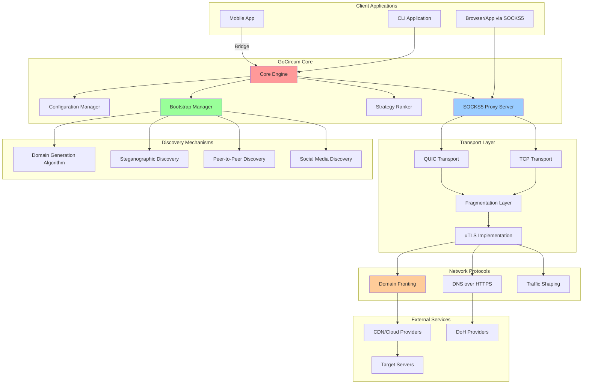

## 2. Component Interaction Flow

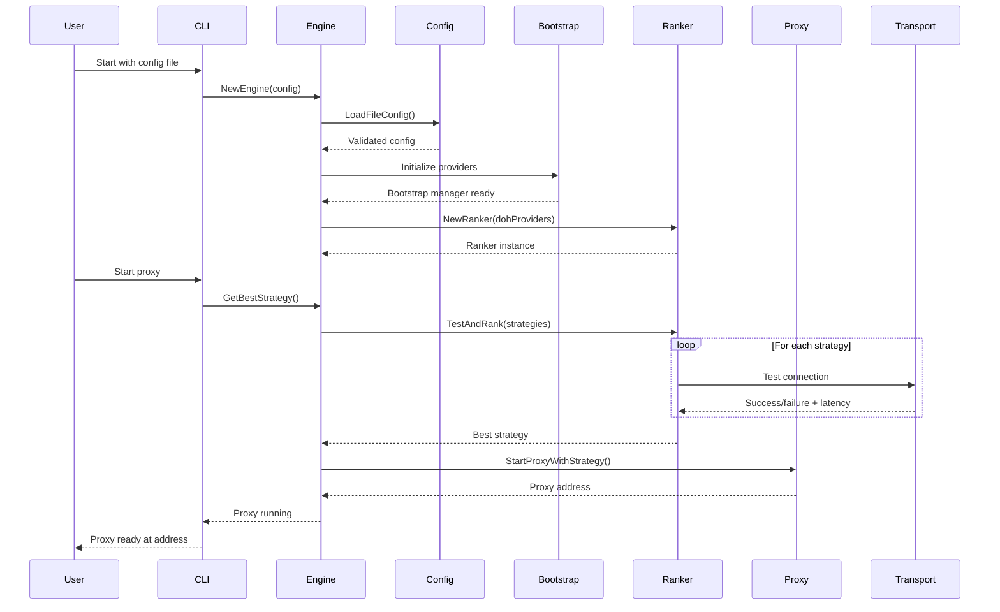

## 3. SOCKS5 Proxy Connection Flow

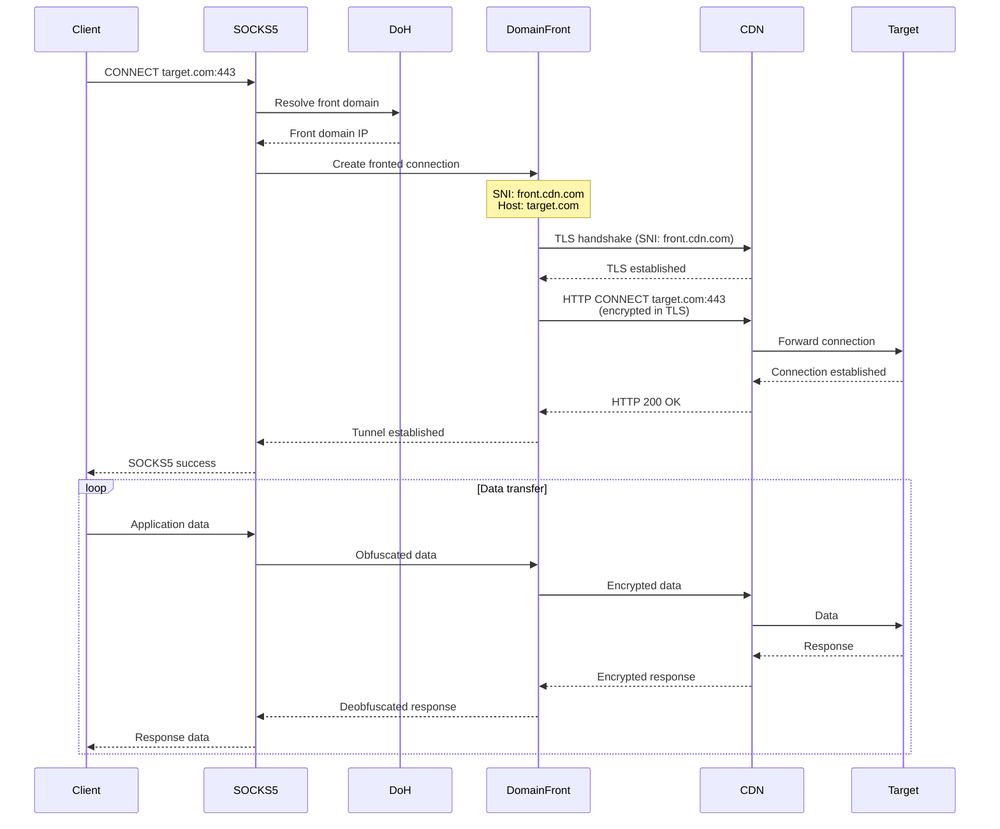

## 4. Bootstrap Discovery Architecture

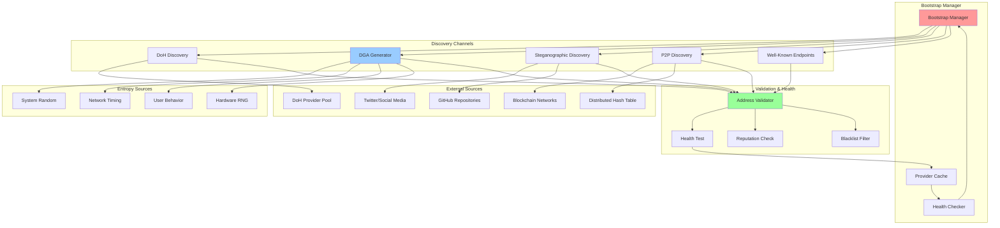

## 5. DNS Resolution Flow with DoH

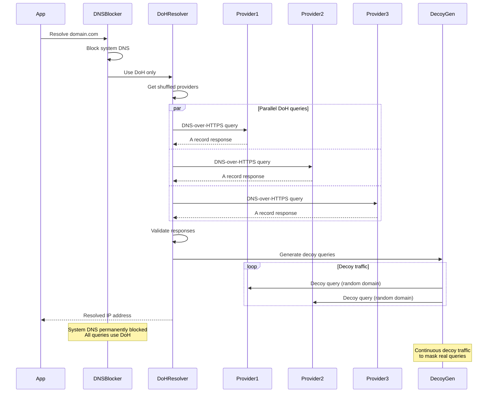

## 6. Strategy Testing and Ranking Flow

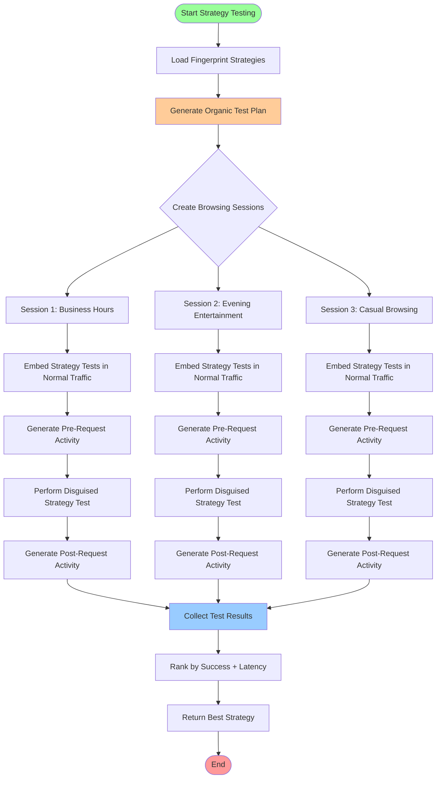

## 7. Traffic Obfuscation and Fragmentation

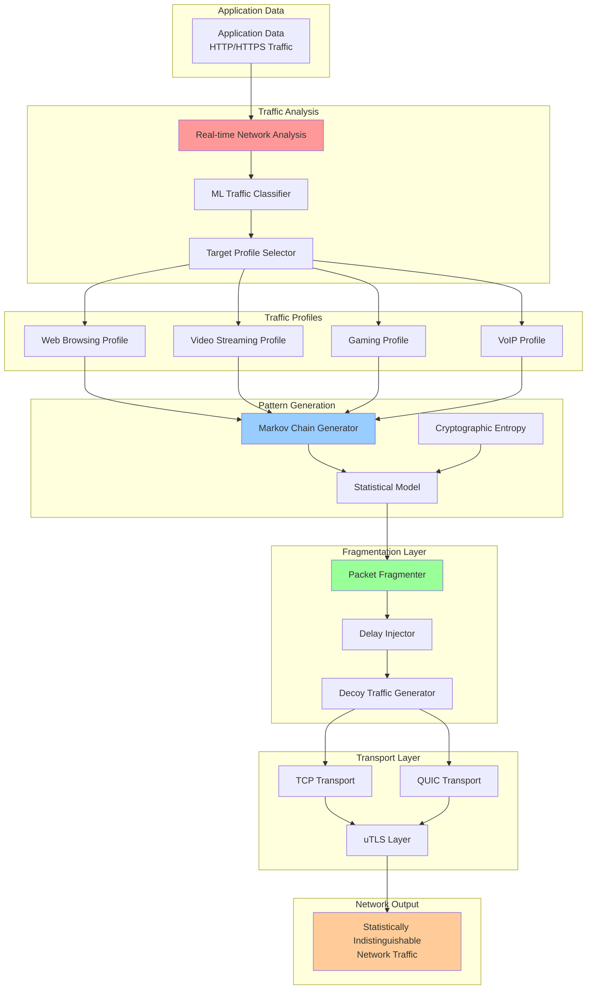

## 8. Configuration Loading and Validation

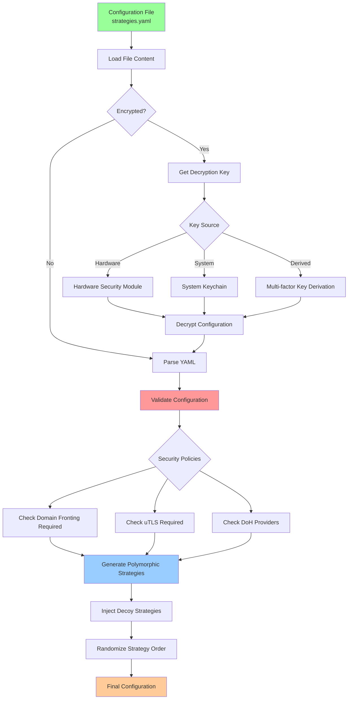

## 9. Mobile Bridge Architecture

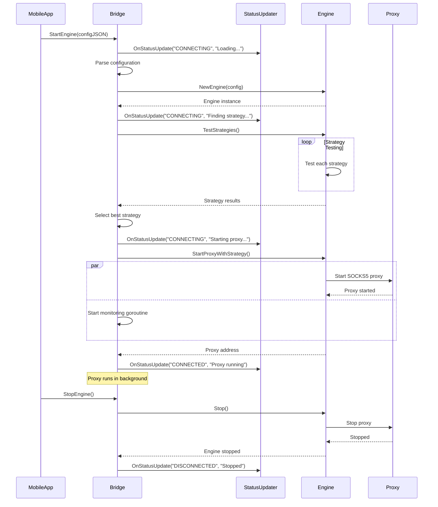

## 10. Entropy Management and Security

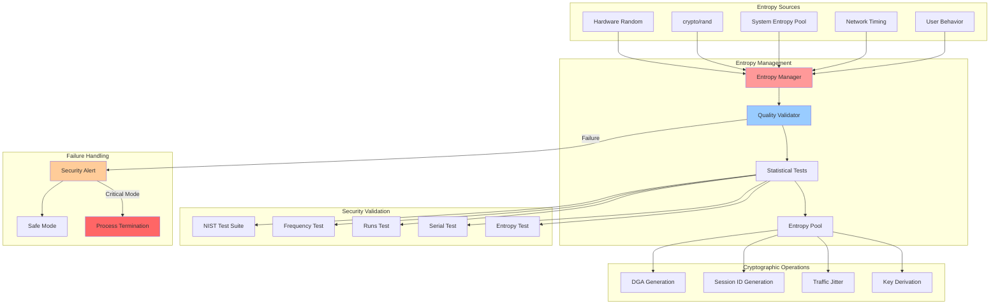

## 11. Domain Fronting Connection Flow

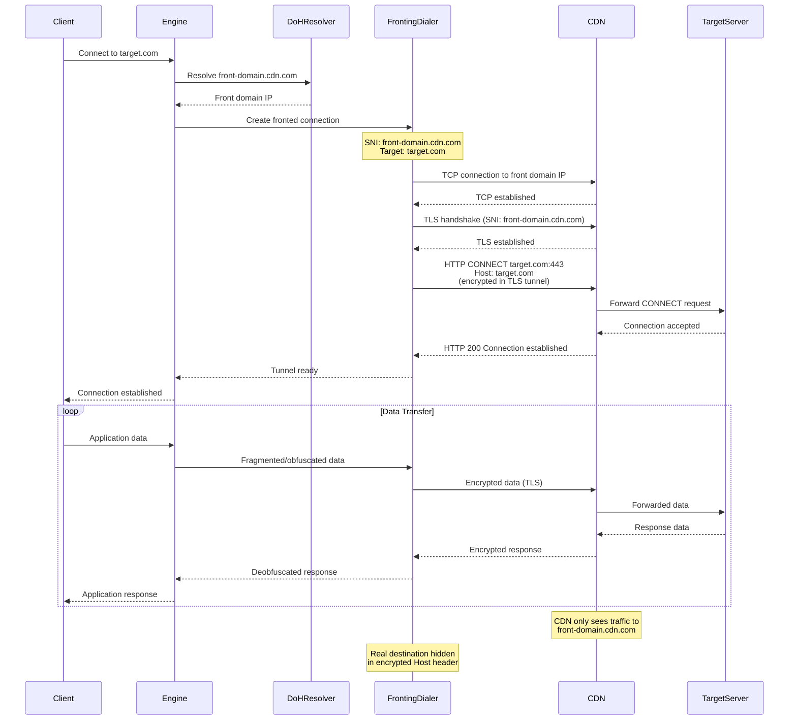

These diagrams provide a comprehensive visual understanding of the GoCircum system architecture, data flows, and security mechanisms. Each diagram focuses on a specific aspect of the system to help understand how the components interact and how data flows through the censorship circumvention pipeline. 